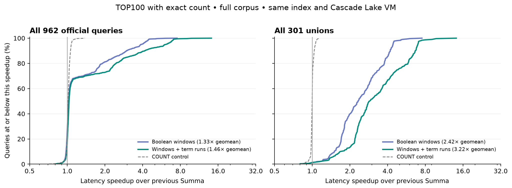

# Bulk-scoring follow-up (2026-09-13)

The retained build returns exact counts and passes exhaustive ranking checks,
but still takes **2.30–2.84× Tantivy's time** across the official commands. Bulk
scoring produced large gains: the frozen v2 prototype improves TOP100+COUNT
1.46× overall and 3.22× for unions. A subsequently discovered corruption bug
required structural validation, adding measurable load cost. Both the gains and
the cost are included below; this is not a leadership claim.

This follows the [ratio-bound experiment](search-benchmark-ratio-results.md) and
[Lucene research](lucene-11-performance-research.md). The retained source is
`summa-bulk-final-v1`: v2 bulk scoring, standalone term windows and posting
validation, without the experimental phrase hint. Absolute times belong to this
machine and protocol; compare implementations within each phase.

## Retained build: full-corpus results

Geometric means of per-query median microseconds. V2 is the same-index frozen
bulk-scoring predecessor without the new structural validation. All four binaries
were measured in this phase, with ten-second warmups and seven samples per query.

All 962 official queries:

| Command       |        V2 |  Retained | Tantivy | V2/retained | Retained/Tantivy |
| ------------- | --------: | --------: | ------: | ----------: | ---------------: |
| TOP_10        | 1,415.335 | 1,589.342 | 559.606 |      0.891× |           2.840× |
| TOP_1000      | 2,047.779 | 2,187.585 | 951.957 |      0.936× |           2.298× |
| TOP_100_COUNT | 2,086.544 | 2,211.890 | 882.932 |      0.943× |           2.505× |
| COUNT         | 1,004.390 | 1,082.535 | 426.515 |      0.928× |           2.538× |

All 714 distinct workload terms:

| Command       |        V2 |  Retained | Tantivy | V2/retained | Retained/Tantivy |
| ------------- | --------: | --------: | ------: | ----------: | ---------------: |
| TOP_10        |   350.268 |   359.424 |  49.099 |      0.975× |           7.320× |
| TOP_1000      |   913.609 |   911.378 | 416.858 |      1.002× |           2.186× |
| TOP_100_COUNT | 1,097.574 | 1,052.355 | 260.224 |      1.043× |           4.044× |
| COUNT         |    51.675 |    51.835 |   6.856 |      0.997× |           7.560× |

The official union TOP100+COUNT result is 4,336.467→4,392.589 µs versus
Tantivy's 2,590.263 µs. The bulk-scoring gain largely survives the correctness
fix in this family. Ranked union TOP10 is an unresolved regression:
1,418.656→1,705.578 µs. Removing the phrase prototype did not recover it, so it
cannot be attributed solely to the phrase hint. The full variant with that hint
is 4.8% faster on official TOP10 than the retained build, while the retained
build is 3.2% faster on supplemental TOP100+COUNT and 2.3% faster on supplemental
TOP1000. The extra hook is left out because the cross-workload benefit is not
established; its measured wins and losses are preserved.

The retained build's official peak RSS is 973.7–974.4 MiB for ranked commands
and 945.2 MiB for COUNT, within 0.4 MiB of v2 in the same phase. The supplement's
ranked peaks rise by at most 1.3 MiB. These are whole-process peaks including
mmap residency. The separate matched Tantivy RSS audit below uses its own
three-repetition protocol; its absolute peaks must not be mixed into this phase.

## What changed

Complete ranked collection previously alternated scalar calls across union
children for every matching document. V1 lets each child contribute to one
4096-document score window and membership bitset; the collector still visits
and counts every matching document. Nested queries contribute their complete
child score, preserving the original addition order. V2 gathers persisted
lengths and computes canonical BM25 over contiguous decoded posting runs before
scattering scores into that window. Existing posting codecs, formats, scorers,
position cursors and collector ownership are reused.

The work follows the batching principle in Lucene's pinned
[TermScorer](https://github.com/apache/lucene/blob/1160d3c8a256ee967b16df7e9e26ec39da3aea01/lucene/core/src/java/org/apache/lucene/search/TermScorer.java).
No answer cache, query-specific branch, approximate count, scoring-model change,
or new index encoding is involved. Default dictionary cache and codec settings
remain unchanged. Unsupported query shapes and position collection retain their
existing paths. Deadline checks surround window work and collection.

Scratch is one 4096-float score array plus a 64-word mask, with two 128-float
arrays in the term batch calculation. Process RSS must be considered separately
from this bounded per-query scratch. A separate matched three-repetition run of
all 962 queries reports peak RSS of 963.7–964.4 MiB for v2 ranked commands and
935.8 MiB for COUNT. Tantivy uses 714.7–714.8 MiB ranked and 705.2 MiB COUNT.
These process peaks include resident mmap pages, caches and runtime state; they
are not heap-only allocations. Summa still uses materially more resident memory.

## Frozen bulk-scoring prototypes

Geometric means of per-query median microseconds:

| Command       | Previous Summa |        V1 |        V2 | Tantivy | Previous/V2 | V2/Tantivy |
| ------------- | -------------: | --------: | --------: | ------: | ----------: | ---------: |
| TOP_10        |      1,447.345 | 1,463.977 | 1,425.605 | 572.723 |      1.015× |     2.489× |
| TOP_100       |      1,790.232 | 1,765.611 | 1,708.041 | 739.119 |      1.048× |     2.311× |
| TOP_1000      |      2,134.872 | 2,110.448 | 2,035.710 | 961.663 |      1.049× |     2.117× |
| TOP_100_COUNT |      3,076.521 | 2,318.678 | 2,103.758 | 899.927 |      1.462× |     2.338× |
| COUNT         |      1,003.917 |   985.377 |   987.513 | 428.429 |      1.017× |     2.305× |

For all 301 unions, TOP100+COUNT is 14,112.282 / 5,833.288 / 4,380.319 µs
for previous / v1 / v2 Summa. Thus the term-run change adds 1.332× beyond
Boolean windows alone. Tantivy takes 2,683.812 µs. The union COUNT control is
1,045.372→1,044.431 µs, essentially unchanged, supporting attribution of the
large full-scoring gain. Small ranking-only changes include movement in paths
that do not use score windows and should not be attributed entirely to batching.

The plot includes every query; values below one are slower. It separates the
full suite from its complete union family and retains the count-only control.

All 714 distinct terms from the official queries, with no selection:

| Command       | Previous Summa |        V2 | Tantivy | Previous/V2 | V2/Tantivy |
| ------------- | -------------: | --------: | ------: | ----------: | ---------: |
| TOP_10        |        362.956 |   363.529 |  52.664 |      0.998× |     6.903× |
| TOP_1000      |        915.677 |   933.267 | 424.255 |      0.981× |     2.200× |
| TOP_100_COUNT |      1,098.057 | 1,132.276 | 257.253 |      0.970× |     4.401× |
| COUNT         |         52.649 |    52.058 |   7.159 |      1.011× |     7.271× |

For TOP100+COUNT, 298/301 unions improve and 296 improve by more than 10%.
One union is over 10% slower: `shih tzu` (1,372 exact hits) changes
458.5→571.5 µs while its COUNT control is 257.5→256.5 µs. This is retained as a
performance finding, not dismissed as control drift. Repeatedly initializing
large score windows for sparse matches is a plausible cost to profile next.
Grouping all unions into five equal-size groups by exact hit count gives
geomean speedups of 1.69×, 2.32×, 3.01×, 4.36× and 6.66×. The aggregate therefore
contains both the sparse regression and the broad high-volume gains.

V2 does not yet advertise replacement score windows for standalone terms, so
those full-score requests retain scalar collection. Their slight regression is
retained in the evidence. The subsequent v3 experiment extends the same batch
owner to standalone terms; it passes 1,647 native tests and 20 WASM tests. A paired ARM repeat gives
22.968→20.650 µs for all 714 terms on TOP100+COUNT (1.112×), with COUNT
7.102→7.094 µs. The intermediate full-corpus v3 measurements give 1,073.816→1,050.557 µs (1.022×) for
TOP100+COUNT across all 714 terms, while COUNT is 51.871→52.103 µs. Official
TOP100+COUNT is essentially flat at 2,096.396→2,094.709 µs. Thus the full-corpus
x86 gain is much smaller than the 100k ARM gain. The term supplement's TOP10
moves 361.309→347.375 µs, but TOP1000 moves 922.990→945.991 µs; these controls
are retained and do not support a broad ranking acceleration claim.

## Protocol and correctness

machine: `benchmark-host`, GCloud `n2-highmem-8`, Intel Cascade Lake, 64 GiB RAM,
Ubuntu 24.04, zone `us-east1-b`. Rust engines use rustc 1.98.1, native instructions
and release LTO. The public benchmark revision is
`a7c75473e91746280c5f01e69bf594ece5fca560`; corpus and queries follow the previous
reports. Both indexes contain the same transformed corpus and one segment.
All Summa versions read the same ratio-bearing index bytes. Queries and driver
children are pinned to CPU 2. Builds, indexing, tests and profiling are excluded
from timed search. Official warmups are 60 seconds with ten samples per query;
the supplement uses ten seconds and five samples. Parsing and pipe round trips
are included, opening and hydration excluded. These are warm-cache latency
measurements, not throughput or cold-storage results.

All 1,676 official/supplemental queries pass for each of the three Summa
versions: exact counts match Tantivy, and pruned top-10/100/1000 IDs and score
bits match exhaustive Summa collection. Cross-engine score-bit equality is
not claimed. TOP100+COUNT performs complete scoring and exact membership
collection; it does not use competitive pruning to estimate its count.

V2 passes formatting, Clippy, native without sync, 1,644 native tests (26 ignored,
24 suites), and the WASM build plus all 20 WASM tests. Regression coverage includes
nested addition, boosted/legacy BM25 score bits, posting-run stop/resumption,
position cursors, all posting codecs, tail/terminal IDs and expired windows.
The phrase prototype separately passes 1,646 native tests and 20 WASM tests.
A source-archive timestamp hazard was caught before timing: Cargo initially reused
an older v1 executable. Both candidates were freshly rebuilt with touched root
dependencies; distinct hashes and batch symbols were verified before any query
timing. No stale-binary samples are included.

## ARM cross-check and pending experiments

On the first 100,000 documents, the frozen previous/v1/v2 comparison gives
TOP100+COUNT 62.614/51.726/51.546 µs overall and 149.572/84.203/80.606 µs for
unions: 1.21× overall and 1.86× unions. Ranking/count controls are approximately
flat. ARM disassembly contains four-lane canonical BM25 arithmetic. This small
fixture supports the mechanism across architectures, not full-corpus ARM claims.

The phrase prototype's paired ARM timings are inconclusive. Only 34/300 phrases
have more than ten hits there, versus 293 on the full corpus. Its cloud phase improves the phrase TOP10 family 1,423.049→1,328.020 µs
(1.072×), but the unchanged ranked union family moves 1,404.506→1,543.037 µs.
Overall TOP10 is 1,402.732→1,426.562 µs. TOP100+COUNT and COUNT are approximately
flat. The final alternating paired comparison against v2 confirms the tradeoff:
phrase TOP10 improves 1,103.082→977.068 µs (1.129×), while union TOP10 slows
1,059.883→1,178.364 µs (0.899×). Overall TOP10 is flat (1.004×), TOP1000 is
0.989×, TOP100+COUNT 0.999× and COUNT 0.992×. The later removal control did not recover the union regression and traded
performance between workloads, as shown in the retained-build section. The hook
remains outside the retained implementation; its source and results are preserved. The proposed [BM25 impact envelope](posting-codecs.md#proposed-bm25-impact-envelope-research-not-implemented)
is still an offline mathematical/storage experiment, with no production format
or latency claim. Dictionary lookup and ranked intersections remain substantial
costs. No sparse-index speedup has been measured in this pass.

Raw results and exact source overlays are in the
[versioned evidence package](benchmark-results/bulk-scoring-2026-09-13/README.md). The final capture contains 228 hash-verified evidence files, and full manifests
confirm both index byte sets are unchanged across every candidate. Source hashes
distinguish all prototypes from the retained build. The machine and its auto-deleted boot disk are gone;
[the cleanup audit](benchmark-results/bulk-scoring-2026-09-13/cleanup.json) records
the empty instance/disk listings after verified local capture.

## Profile evidence and a subsequent correctness fix

Separate full-union profiles attribute 35.29% of the prior implementation's
samples to term scoring, 18.06% to term `doc`, 10.33% to term `seek` and 9.48%
to Boolean scoring. With v2, 54.05% is in the batched term accumulator, 22.67%
in top-k collection and 12.08% in the collection driver. Samples move from
per-hit dispatch and cursor operations into useful scoring and collection.
The x86 disassembly includes eight-lane `vmulps`, `vaddps` and `vdivps` in
canonical BM25; ARM uses four-lane NEON. These are supporting profiles taken
outside timing, not a substitute for the latency comparison.

A later correctness probe found that an invalid block codec was accepted by
deserialization and converted into empty results by an infallible iterator.
The corrected build validates posting directory/header/payload structure before
exposing those views, sharing the block validator with compaction. It has a
behavior regression and a sync/async public-search regression. This adds load
work; the v2/v3 tables above describe the frozen pre-fix candidates, and must
not be presented as measurements of the corrected build. It passes 1,651 native tests (26 ignored, 25 suites), formatting, Clippy, native
without sync, the WASM build and all 20 WASM tests. The final candidate, with the phrase experiment removed, separately passes
1,649 native tests (26 ignored, 25 suites) and all 20 WASM tests. Its matched performance is reported above.

The final clean paired ARM comparison against v2 retains the standalone gain:
all 714 terms take 23.051→20.547 µs for TOP100+COUNT (1.122×), with COUNT
11.289→11.275 µs and TOP10 20.639→20.651 µs. Official commands are within
about 1.1%, including the unchanged count control. The first final-ARM pass
overlapped a brief ZIP packaging job; its complete raw output is retained but
excluded, and both workloads were rerun in full afterward.

In the isolated full-corpus validation comparison (both builds still include
the later-rejected phrase prototype), TOP10 moves 1,407.595→1,537.182 µs,
TOP1000 2,043.366→2,174.353 µs, TOP100+COUNT 2,050.039→2,178.410 µs and COUNT
1,007.733→1,090.950 µs. Structural checks therefore add about 6–9% overall on
this corpus. This cost is retained, not hidden by an unsafe switch. Reusing
validated immutable metadata under a bounded reader-owned cache is a future
possibility; no validation or answer cache is introduced in this pass.

The full lifecycle/RPC harness, GPU/client suites, cold-storage latency,
concurrent ingest/merge and throughput were not rerun in this pass. No lifecycle
or wire protocol changed; the focused check, native without sync, WASM and
same-index query gates are the validation used here. These warm-cache results
do not establish those unmeasured behaviors.
