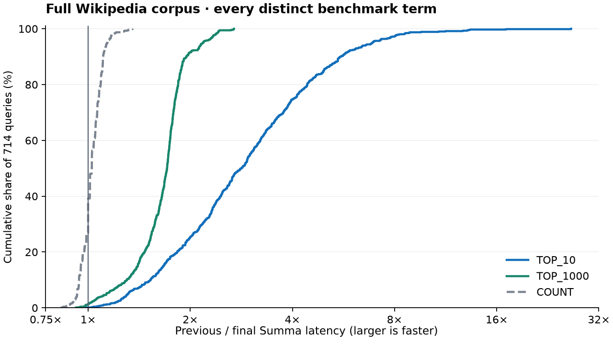

# Score-bound follow-up (2026-09-13)

The final candidate improves all 714 terms by **2.89× for TOP_10** and
**1.65× for TOP_1000**, on the same full-corpus index and machine. The official
962-query ranked commands improve by only **1.8–3.2%** overall; Summa still
trails Tantivy by **2.12–3.37×** across the five commands. This is a targeted
improvement, not a fastest-engine claim.

This follow-up targets the frequent-term ranking gap identified in the
[initial full-corpus benchmark](search-benchmark-results.md). Results below are
from a new dedicated machine and newly built index; absolute times must not be
compared with the previous machine. The original report remains historical evidence.

## Why Summa still trails

A block's maximum term frequency and minimum document length can come from
different documents. Combining them gives a safe but loose BM25 upper bound.
Summa consequently scores blocks whose actual documents cannot enter top-k.
The previous diagnostic skipped only 3.28% of windows; the previous final
standalone-term plan therefore retained scalar traversal.

Lucene retains competitive frequency/norm pairs in its
[impact accumulator](https://github.com/apache/lucene/blob/releases/lucene/10.4.0/lucene/core/src/java/org/apache/lucene/codecs/CompetitiveImpactAccumulator.java).
The implemented Summa extension instead adds one conservative minimum
length/TF ratio per block and skip group. It is compact, independent of queries
and BM25 parameters, and reuses the existing posting codecs, scorer and skip
hierarchy. It is not a full competitive-impact frontier.

Tantivy 0.26's [posting serializer](https://github.com/quickwit-oss/tantivy/blob/0.26.0/src/postings/serializer.rs)
selects an actual fieldnorm/frequency pair maximizing its indexing BM25 factor
for each full block. Its [skip reader](https://github.com/quickwit-oss/tantivy/blob/0.26.0/src/postings/skip.rs)
uses that pair without decoding postings. This helps explain the remaining
pruning advantage. Summa's ratio still combines extrema and can remain loose;
a bounded competitive-impact frontier is the next format candidate to evaluate
under changing global statistics and configurable BM25, with merge-copy costs
included. No performance result is claimed for that unimplemented candidate.

Two execution costs also mattered. A single cursor paid for the general
4096-ID window machinery, and precomputed text results were sorted by document
ID and collected into a second top-k heap. The final candidate uses the existing
128-posting cursor directly for a ratio-bearing single term and the existing
`Scorer::precomputed_top_k` handoff for standalone text results. Boolean
composition still gets ascending document IDs through lazy sorting.

Dictionary decompression, posting alignment and phrase positions remain costs.
The earlier profiles and cache-capacity experiment are recorded in the original
report. This experiment does not change the default 256-block dictionary cache,
position encoding, phrase verifier or BM25 scoring formula.
A separate opportunity is top-k plus exact count: the current collector tuple
scores every match. Exact membership counting and competitive ranking could
use separate passes over the same immutable reader/statistics snapshot, with
full-score collection retained as an oracle. That is a proposal, not an
implemented change or a measured speedup.

## Exactness and format costs

`COUNT` enumerates complete membership or uses an exact guarded dictionary
frequency. Ranked queries may skip only blocks that cannot beat the heap.
`VERIFY` compares Summa's ordered document IDs and score bits at k=10, 100 and
1000 with exhaustive Summa scoring, and compares exact counts with Tantivy.
It does not assert identical scores across engines with different BM25/norm
representations. Every official query and every supplemental term must pass.

`IndexConfig.posting_ratio_bounds` and `summa-tool index
--posting-ratio-bounds` enable the new metadata for newly built segments. The
option remains **off by default**. Readers detect it automatically; existing
indexes retain their original bounds. The extension adds four bytes per L0
block and four per eight-block L1 group, including partial tails. It adds no
per-document score or query-answer cache. Posting and position payload bytes
are unchanged. Compatible merges copy the metadata, and legacy blocks supply
an unknown ratio. Unsupported scoring parameters use the existing bounds.
See [the format and execution design](posting-codecs.md#experimental-ratio-bounds-2026-09-13-follow-up).

Standalone chunked text retains its existing bounded chunk nomination and MaxP
folding contract; the new regression compares that documented candidate pool
and ordinal score bits before and after merging. The ordinary text Wikipedia
workload has complete exact membership and exhaustive ranking gates.

## Measurement protocol

The corpus has 5,032,104 documents; the upstream suite has 962 queries. The
supplement contains all 714 distinct terms from those queries, without selection.
Upstream revision, corpus and query hashes are the same as the original report.
The new machine is `benchmark-host`, GCloud `n2-highmem-8`, Intel Cascade Lake,
64 GiB RAM, Ubuntu 24.04. Both Rust engines use rustc 1.98.1, native instructions
and release LTO. Each index is merged to one segment; the corpus has ordinary
positioned text and no deletions. Deletion and chunk correctness are tested
separately, not benchmarked as production workloads. Timed drivers and children are pinned to CPU 2. Builds, indexing,
tests and diagnostics do not overlap timed search.

Before and after binaries read **the same ratio-bearing Summa index bytes**:
the previous reader safely ignores the additive metadata. Tantivy 0.26 uses its
own index on the same transformed corpus. The main run uses 60-second warmups
and ten repetitions per command; the supplement uses ten seconds and five
repetitions. Tables use geometric means of per-query median microseconds.
Parsing and pipe round trips are included; opening and document hydration are
excluded. Results are warm-cache latency measurements, not throughput or cold
storage measurements.

The ARM cross-check uses the first 100,000 documents of the same corpus, with
one indexing thread and native/LTO builds on the same Mac. It is a smaller
fixture, not evidence of full-corpus ARM performance. The first candidate
regressed supplemental top-10 by 10.2%; it was replaced by the leaner loop.
Raw results retain the rejected candidate and its larger-k tradeoffs.

## Final full-corpus results

All 714 distinct terms, same persisted Summa index:

| Command  | Previous Summa µs | Final Summa µs | Tantivy µs | Summa speedup | Final Summa/Tantivy |
| -------- | ----------------: | -------------: | ---------: | ------------: | ------------------: |
| TOP_10   |         1,359.936 |        470.661 |     80.717 |    **2.889×** |              5.831× |
| TOP_1000 |         1,830.539 |      1,111.002 |    578.466 |    **1.648×** |              1.921× |
| COUNT    |            69.102 |         67.293 |      9.642 |        1.027× |              6.979× |

TOP_10 is faster for 713/714 terms, with 708 at least 10% faster. TOP_1000
is faster for 705/714 terms, with 685 at least 10% faster. Neither command has
a term more than 10% slower in this run. These are comparisons of five-sample
per-query medians, not confidence intervals.

The plot contains every term. The vertical line is equal latency; farther right
means a larger speedup. The counting control stays close to that line.

The final COUNT control is within 2.7%; counting uses neither ratio pruning nor
ranked handoff. The large ranked gains therefore exceed that control drift.
For illustration, `the` TOP_10 falls from 74.122 to 14.085 ms and `in` from
70.466 to 12.098 ms; all 714 terms, rather than these selected examples, determine
the aggregate. Tantivy still wins those examples at 2.604 and 0.559 ms.

All 962 official queries:

| Command       | Previous Summa µs | Final Summa µs | Tantivy µs | Summa speedup | Final Summa/Tantivy |
| ------------- | ----------------: | -------------: | ---------: | ------------: | ------------------: |
| TOP_10        |         1,811.260 |      1,779.870 |    742.734 |        1.018× |              2.396× |
| TOP_100       |         2,176.328 |      2,108.332 |    934.144 |        1.032× |              2.257× |
| TOP_1000      |         2,596.013 |      2,529.973 |  1,195.918 |        1.026× |              2.116× |
| TOP_100_COUNT |         3,710.147 |      3,731.351 |  1,106.011 |        0.994× |              3.374× |
| COUNT         |         1,222.611 |      1,212.597 |    525.689 |        1.008× |              2.307× |

The whole-suite gain is modest: 1.8–3.2% for the ranked commands. Exact-count
commands are essentially flat. Summa still trails Tantivy by 2.12–3.37× across
these commands. The 301 unions improve by 4.6%, 6.3% and 4.9% for TOP_10,
TOP_100 and TOP_1000. This does not close the posting-alignment, phrase,
dictionary or exhaustive-scoring gaps.

## Memory and optional cache capacity

The main same-index comparison has essentially unchanged peak process RSS:

| Command       | Previous Summa MiB | Final Summa MiB | Change MiB |
| ------------- | -----------------: | --------------: | ---------: |
| TOP_10        |             962.12 |          962.81 |      +0.69 |
| TOP_100       |             961.70 |          962.96 |      +1.27 |
| TOP_1000      |             962.60 |          962.98 |      +0.38 |
| TOP_100_COUNT |             961.50 |          962.06 |      +0.57 |
| COUNT         |             933.66 |          934.12 |      +0.45 |

RSS includes resident mmap pages and heap; it is not a measurement of heap
allocation alone. These are `/usr/bin/time -v` peaks for each fresh process
through warmup and all timed repetitions. Tantivy search RSS was not instrumented
in this follow-up; the original report's memory comparison belongs to its own machine.

A separate same-binary/same-index cache comparison raises dictionary capacity
from 256 to 1,024 blocks. Across all 714 terms, TOP_10 is 438.655/322.501 µs
(1.360× faster), TOP_1000 is 1,089.535/939.243 µs (1.160×), and exact COUNT is
65.092/14.900 µs (4.369×). These cache results have their own default control;
they are not multiplied into the main speedups or compared with a Tantivy run
from another measurement phase. The official cache comparison uses 30-second warmups and five repetitions,
with the same final binary and index:

| Command       | Cache 256 µs | Cache 1024 µs | Speedup |
| ------------- | -----------: | ------------: | ------: |
| TOP_10        |    1,758.891 |     1,570.401 |  1.120× |
| TOP_100       |    2,103.063 |     1,891.678 |  1.112× |
| TOP_1000      |    2,551.583 |     2,259.331 |  1.129× |
| TOP_100_COUNT |    3,754.667 |     3,356.900 |  1.118× |
| COUNT         |    1,219.784 |     1,029.051 |  1.185× |

The added peak process RSS is 5.18–5.73 MiB across the five official commands.
That is a useful tradeoff on this single-segment fixture, not a universal cache
setting: decompressed block sizes, segment counts and workload locality matter.
All 1,676 cache-variant exactness gates pass. No cache default changes.

Offline accounting through the production reader validates 3,964,752 external
posting lists, all carrying ratio metadata, and 20,596,128 blocks. The added
ratio arrays total **104,200,464 bytes (99.37 MiB)**, or **1.92%** of the
5,426,175,692-byte index. This accounts for the new arrays, not a rebuilt
before/after total-size comparison; changed dictionary offsets can also affect
compression. The arrays are mmap-backed and evictable, not all forced into
resident heap. The builder took 6m51.64s and peaked at 14,416,680 KiB RSS; no
indexing-speed claim is made because there is no paired build-time baseline on
this machine. The 2 GB builder setting is not a process RSS limit.

The final single-term diagnostic records 329,714 scored blocks and 451,011
skipped blocks (57.77%), including 8,315 group skips. Its block counts are not
the same unit as the first candidate's windows: an ID window can cover only
part of a posting block. Diagnostics run outside timed search.

## Intermediate full-corpus candidate

The first ratio candidate, before the lean single-term loop and ranked handoff,
improves all 714 terms' TOP_10 from 1,461.796 to 818.409 µs (1.786×). TOP_1000
is 1,869.241/1,830.726 µs (1.021×). Its supplemental COUNT is
66.767/74.580 µs, an 11.7% slowdown despite unchanged counting code; this is
retained as a control limitation. The subsequent official COUNT comparison is
flat, 1,237.072/1,241.722 µs. Its diagnostic records 1,317,858 windows and
637,673 skips (48.39% weighted; 37.83% median per query). These counters come
from a separate diagnostic invocation, outside timing. The earlier 3.28%
diagnostic used a different index build, so this is not a byte-matched counter
comparison.

Across all 962 official queries, that first candidate improves TOP_10 from
1,851.481 to 1,790.050 µs (1.034×), TOP_100 from 2,189.427 to 2,167.831 µs
(1.010×), and TOP_1000 from 2,626.843 to 2,610.035 µs (1.006×).
TOP_100_COUNT is flat at 3,731.486/3,731.687 µs. This is an intermediate result,
not the final candidate. Its large term gain does not imply a similar whole-suite
gain: the official set contains only one standalone term.

## ARM cross-check

The first candidate's general single-cursor window loop regressed the 714-term
aggregate. The direct block loop removed the top-10 regression; ranked handoff
then removed most of the top-1000 overhead. The final paired run gives:

| Workload            | Command  | Previous µs | Final µs | Speedup |
| ------------------- | -------- | ----------: | -------: | ------: |
| All 714 terms       | TOP_10   |      31.820 |   28.487 |  1.117× |
| All 714 terms       | TOP_1000 |      51.250 |   51.881 |  0.988× |
| Official 962        | TOP_10   |      45.412 |   45.568 |  0.997× |
| Official 962        | TOP_1000 |      65.495 |   63.627 |  1.029× |
| Official 301 unions | TOP_1000 |     164.115 |  143.735 |  1.142× |

Official COUNT was 37.499/37.744 µs, while supplemental COUNT was
20.248/17.755 µs. COUNT does not use the new score bounds or ranked handoff.
The supplement's control drift limits attribution of small aggregate changes.
The two ARM index builds also differ in dictionary offsets/compressed bytes
because the optional metadata changes posting offsets. A reversed-order repeat
and same-binary plain/ratio comparison are retained separately. In that repeat,
final ratio/plain TOP_10 is 28.263/31.963 µs (1.131×), TOP_1000 is
51.453/51.481 µs (flat), and COUNT is 18.309/20.385 µs. The previous binary on
the plain index gives 32.240/51.408/19.704 µs. The full-corpus paired experiment
avoids these index differences by using identical bytes.

A further reversed-order official run isolates execution on the **same legacy
index**, with no ratio metadata in either engine. The final handoff improves
TOP_1000 from 66.182 to 61.580 µs overall (1.075×), and the 301 unions from
164.865 to 137.433 µs (1.200×). TOP_10 is 44.861/45.146 µs and COUNT is
36.489/36.642 µs, both essentially flat. This is the small ARM fixture; it shows
that the handoff can help existing indexes without rebuilding.

## Validation

The final candidate passes `python3 scripts/check_search.py check`: 1,640 tests,
26 ignored, 24 suites; formatting, Clippy and native without sync also pass.
The WASM build and 20 WASM tests pass. Earlier `full` validation of the ratio
format/merge changes passes all eight phases, including the real server/broker
checks. Later changes are confined to query execution and result handoff.

New tests cover conservative bounds across TF/length/parameter extremes,
saturated persisted lengths, canonical score bits, global statistics, deletions,
malformed extension rejection, unchanged payload bytes, legacy/ratio copy
merges, metadata budget failure, cancellation, bounded chunk nomination and
ordinals, lazy document traversal, and ranked-handoff collector equivalence.
All 1,676 full-corpus gates pass for the previous binary, first ratio candidate
and final candidate, including the final x86 test suite. The ARM gates also
pass on both legacy and ratio-bearing indexes. Full official and supplemental
timing runs are complete; no query is removed from either set.

## Evidence and reproduction

The [versioned evidence bundle](benchmark-results/score-bounds-2026-09-13/README.md)
contains complete timing samples, exactness gates, validation logs, memory
records, hashes and scripts, with per-file SHA-256 verification. It retains
intermediate candidates and separate ARM/cache runs without pooling them into
the final result. The larger local `.context/summa-ratio-benchmark-evidence.tar.gz`
also preserves the cloud archive, Linux/ARM binaries, base Git bundle, frozen
source overlays and ARM corpus prefix; its checksum is stored alongside it.
The original benchmark bundle remains intact.

The measured final code is the `summa-ratios-v3` overlay over base revision
`ce2c96b945fccc4bac58ccc45bb4bc23b809773e`, with the earlier optimized overlay as
the before control. Full manifests and binary hashes are included. Later edits
only finish documentation and evidence packaging; production source still
matches the measured v3 manifest.

Enable the new format on newly indexed data with `summa-tool index
--posting-ratio-bounds` or `IndexConfig.posting_ratio_bounds = true`; readers
detect it automatically. The ranked-result handoff also benefits existing
indexes without rebuilding. The benchmark adapter's `--term-cache-blocks 1024`
selects the separately measured cache budget; the corresponding index setting
is `IndexConfig.term_cache_blocks`. See the [complete protocol and runtime
controls](search-benchmark-game.md#runtime-controls) for normal indexing arguments,
compiler flags, commands and exact/exhaustive verification.

The temporary machine `benchmark-host` and its automatic-delete boot disk were
deleted after the cloud archive was downloaded and verified. Both resource
list checks return empty; cleanup evidence is included in the local bundle.
